### django로 HTML에 Chart 그리기
#### ChartApp 생성
- `Python manage.py startapp` _"ChartApp"_

- 프로젝트에 `settings.py` 에 ChartApp 등록하기
>   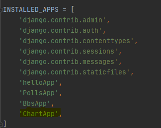

- 프로젝트에 `urls.py` 에 `ChartApp urls` 등록하기
>   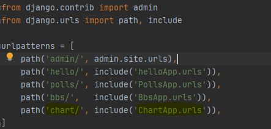
>> - `'chart/'` 는 url 주소, include('ChartApp.urls') 는 ChartApp `urls.py`를 참고 하겠다는 의미.

- templates 폴더와 urls.py 생성.
>   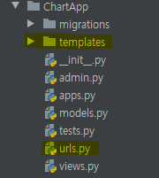

- `urls.py`에 기본 index 화면 등록하기 (`ChartApp views` import 필수!)
>   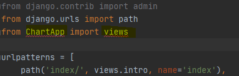

#### 기본 Index 화면 띄우기.
- urls.py에 views.intro 이름과 같은 이름의 함수 `views.py`에 생성.
>   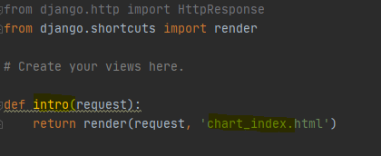
>> - url창에 `localhost:8000/chart/index`를 입력하면 urls.py에 path를 따라서 views.`intro` 이름의 함수를 찾아 chart_index.html을 화면에 띄워준다.

#### chart_index.html
>   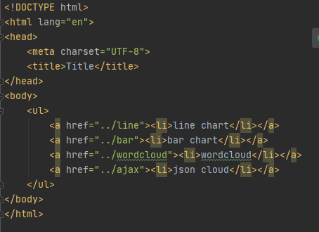
> - `localhost:8000/chart/index`
>   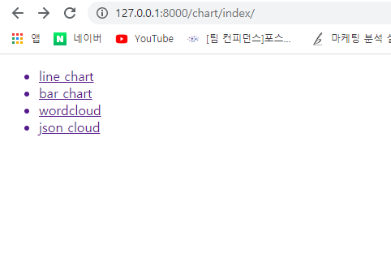

- 각 라인에 하이퍼링크로 다음 화면으로 이동

- 하이퍼링크로 이동하기 위해 `urls.py`와 `views.py`에 path 와 def 를 정의 해주고 원하는 일므의 html파일 생성.
>   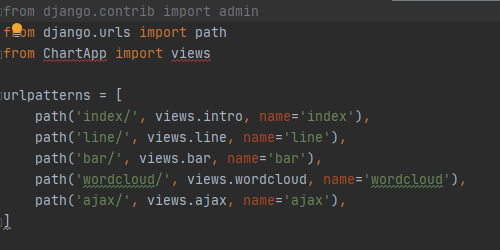
>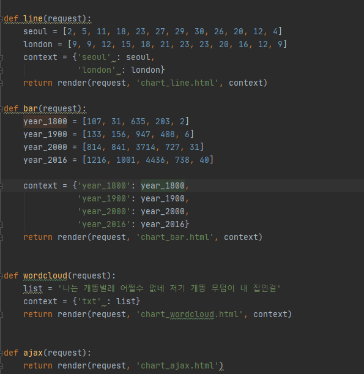
>   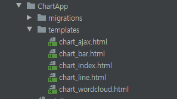
---
- 이후 각 html 파일에 차트를 만들어주는 `script` 와 `style` 정의 

>   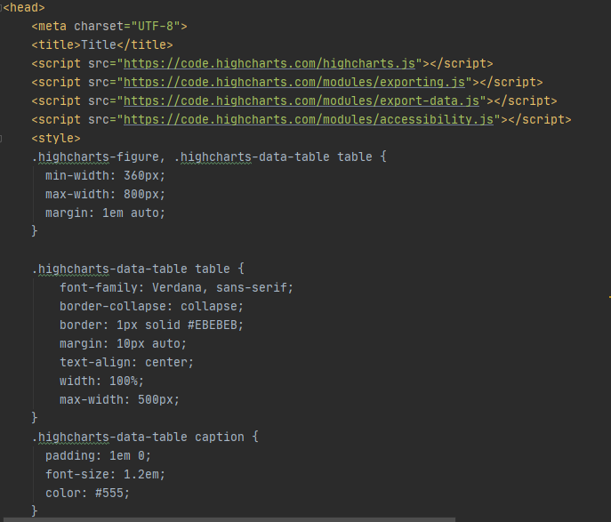
> - _head_ 에 정의해준 _script_ 와 _style_ 을 사용하기 위해 `body` 부분에 `script` 정의
>   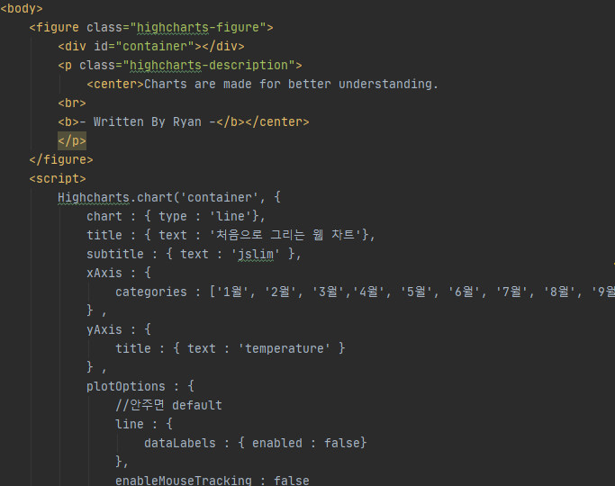
---
- `line chart`
>   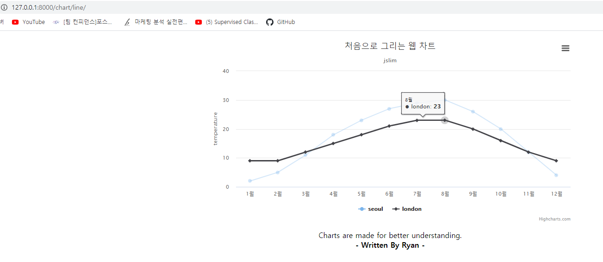

- `bar chart`
>   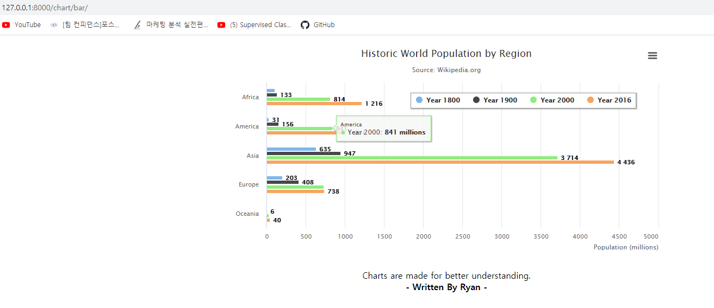

- `wordcloud`
> 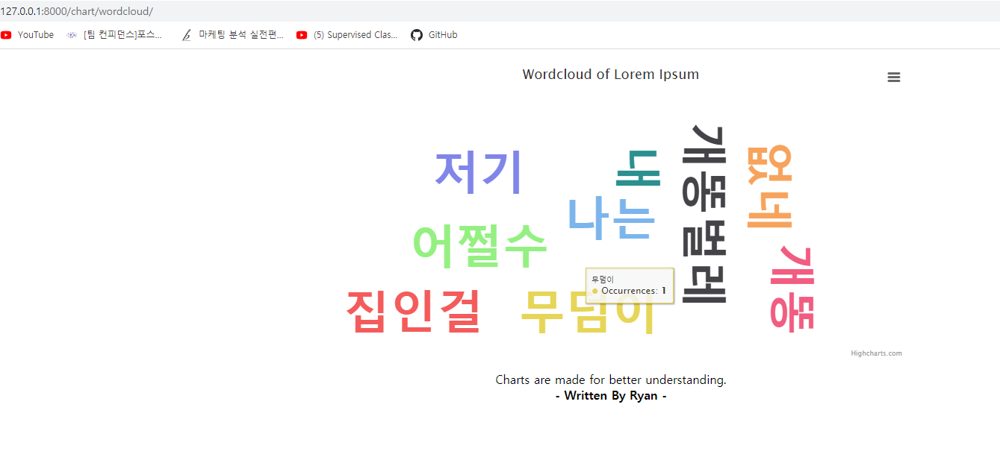

- `json chart`
>   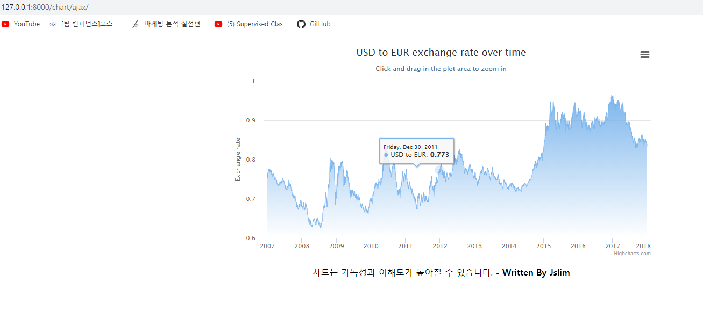
---
#### Highcharts
- Highcharts는 웹상에서 쉽게 차트를 그릴수있게 도와주는 제품이고 Demo로 쓸수있는 다양한 차트들이 존재한다. (`https://www.highcharts.com/`)

- 사이트에서 제공하는 Demo를 보면 `HTML`, `CSS`, `JS(JavaScript)` 를 어떻게 사용하는지를 제공해준다.

- 내가 원하는 **데이터**를 이용해 차트를 만들려면 `JS` 부분에서 `data` 파트를 건드려 주면 된다.