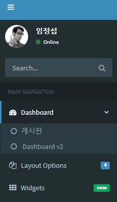
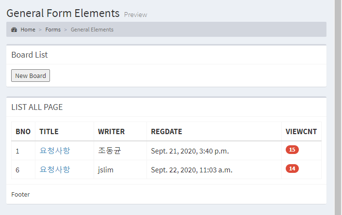
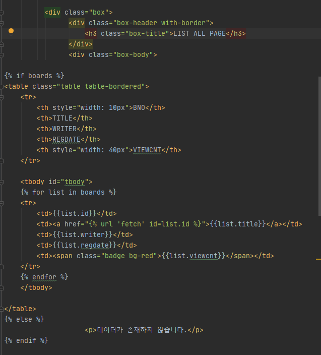

#### list.html
- Home 화면에 좌측 상단을 보면 메뉴 표시가 있다.
- 메뉴를 열어보면 아래와 같은 메뉴를 볼수 있다.
- 이번에는 여기서 Dashboard에서 게시판을 처리하는 html을 보겠다.
> 
> - 게시판 관련 html 역시 이미 있는 form을 사용 할 것이다.
> - `list.html`을 확인해 보면 이번에는 <form>이 아니라 <table>, <tr>, <td> 로 이루어진 것을 볼 수 있다.
> - 아무래도 게시판은 table 형식으로 여러 글들이 올라와 있는 모습을 상상할 수 있다.
> 
> - 이렇듯 여러개의 테이블형식을 만들어 주기 위해서는 <table> 포맷이 필요하다.
> 
>   
>
> - 
 로 division을 만들어 box형식으로 table을 생성하였다.
> - talbe의 컬럼명을 명시하고 그 아래 <tbody>를 이용해 각 컬럼에 입력할 값을 지정하는 것을 볼 수 있다.