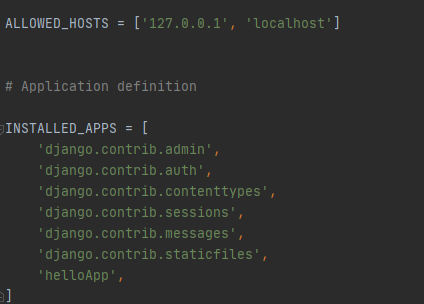

# **Back-End (Server side)**

**## Django Web Framework**
### MVT 패턴
---
#### MVT 패턴이란?
>Django Framework에서는 View를 Template으로, Controller를 View라고 표현하며, MVC(Model, View, Controller)를 MVT(Model, View, Template) 패턴이라고 한다. 모델은 데이터 베이스에 저장되는 데이터를 의미하는 것이고, 템플릿은 사용자에게 보여지는 UI부분을, 뷰는 실질적으로 프로그램 로직이 동작하여 데이터를 가져오고 적절하게 처리한 결과를 템플릿에 전달하는 역할을 수행한다.
---
#### MVT 로직 처리 과정
1. Client로 부터 Request를 받으면 `URL conf` 가 사용자 요청 파악
2. 분설 결과를 통해 해당 URL에 대한 알맞는 처리 `View`를 결정.
3. View는 자신의 로직을 실행하면서 DB의 필요성이 있으면 `Model`에게 요청 및 반환 받는다.
4. View는 자신의 로직 처리가 끝나면 `Templates Rendering`을 통해 Response 할 HTML 파일을 생성한다.
5. View는 최종 결과로 HTML 파일을 클라이언트에게 보내 응답한다.

> - `Model` & `DB` -> persistence영역 / Django 에서는 `Model`
> - `Template` -> MVC에서는 View 영역 / Django 에서는 `Templates`
> - `URL conf` & `View` -> Django 에서는 `View` 영역

---
### MVT 코딩 순서
1. 프로젝트 뼈대 만들기 : 프로젝트 및 앱 개발에 필요한 디렉토리와 파일 생성
2. 모델 코딩하기  : 테이블 관련 사항을 개발(models.py, admin.py파일)
3. URL conf 코딩하기 : URL 및 뷰 매핑 관계를 정의 (**urls.py** 파일)
4. 템플릿 코딩하기 : 화면 UI 개발 (templates/디렉토리 하위의 *.html 파일들)
5. 뷰 코딩하기 : 어플리케이션 로직 개발 (view.py 파일)
  >- 순서는 크게 상관없음.
  ---

### 명령어
- django 프로젝트 폴더 생성
    - `django-admin startproject [폴더명]`
    > ex) django-admin startproject `djangoWEB` 
    >
    > 


- 현재 디렉토리안에 목록 확인
    - `dir/w` or `dir`
    > ex) dir/w 
    > 
    > 

- App생성
    - `python manage.py startapp [앱이름]`
    - 각 app 안에 View가 들어있다.
    > ex) python manage.py startapp 
    >
    > 

- server 실행
    - `python manage.py runserver`
    - `python manage.py runserver 9000` -> 이렇게 하면 9000번 포트로 열림.
    > ex) python manage.py `runserver`
    >
    > 


----
### MVT 패턴


### djangoweb `Settings.py`

```python
    ALLOWED_HOSTS = ['127.0.0.1', 'localhost']
    ROOT_URLCONF = 'djangoweb.urls'

    # 내장 DB 포함.
    # 오라클로 바꾸고싶으면 ENGINE만 바꾸면된다.
    DATABASES = {
        'default': {
            'ENGINE': 'django.db.backends.sqlite3',
            'NAME': os.path.join(BASE_DIR, 'db.sqlite3'),
        }
    }
```

> 각각의 App들을 settings.py 에 등록을 해줘야지만 `url conf`가 찾아들어간다. 
> App안에 urls.py 가 View를 찾아들어가는 형식으로 만든다.
> 
> 

---
### `djangoWEB urls.py`
```python
from django.contrib import admin
from django.urls import path

urlpatterns = [
    path('admin/', admin.site.urls),
    path('hello/', include('helloApp.urls')) # helloApp.urls를 찾겟다라는 뜻
    # http://serverip:port/hello/xxxx 이라고 사용자가 입력한다는 의미
    # xxxx 가 최종적인 이름을 나타낸다.
]
```


>- App이 있을경우 App의 View코드와 연결시켜줘야 한다.
>- 현재는 helloApp이 있으므로 연결해줘야 한다.
---

### helloApp `views.py`

- views.py 에 만드는 함수들은 사용자의 요청을 받아서 응답을 하는 구조로 이루어진 함수들이다.
- 정의되어있는 `index` 라는 함수의 이름이 사용자가 입력하여 찾아 들어오는 URL 에 이름
이라고 생각하면 된다.

### helloApp `urls.py`
- 웹클라이언트 (브라우저)에서 Reqeust 가 오면 helloApp내부 urls.py 에 이렇게 정의를 해야 `index`를 찾아 갈 수 있다.

```python
from django.urls import path
from helloApp import views

urlpatterns = [
    path('index/', views.index)     
    # views.index는 views.py에서 index라는 이름의 함수를 찾겠다는 의미.
]
```

>`Render`는 View에서 Model에게 DataBase를 요청한 후 가져온 것을 `Templates`을 통해서 보여주기 위해 사용.

- templates에는 html이 담겨있다. 정적 html에 경우 사용하는 `<div 방법>`
1. html`(tag + text)`
2. `{{ print }}`
3. ``
4. ``


***중요**

post방식으로 보낼때는 보안상에 이유로 `` 을 넣어줘야 한다.
```html 
<div align="right">
        <form method="post" action="">

            

            <label>아이디</label> <input type="text" name="id" />
            <label>비밀번호</label> <input type="password" name="pwd" />
            <input type="submit" value="LOGIN">
        </form>
    </div>
```

- get 방식으로 넘겨받으면
    - http://127.0.0.1:8000/hello/login/?id=asdfgsd&pwd=asddfsafd

- post 방식으로 넘겨받으면
    - http://127.0.0.1:8000/hello/login/

# Model (ORM)

## 모델 마이그레이션
### 사용자 모델 -> DB(테이블) 만드는 명령어
- `python manage.py makemigrations` - 모델을 가지고 테이블을 만든다.
- `python manage.py migrate` - 테이블 속성들 전이 시킨다.
- `python manage.py createsuperuser` - DB가 진짜 있는지 확인하기 위한 admin 계정 하나 생성.

