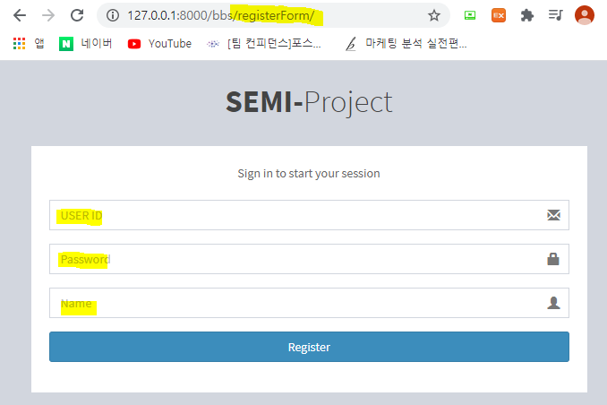

### django WEB

- 장고에서는 MVT 패턴을 사용한다.
> **M**odel    : ORM DB 생성을 도와주는 역활
>
> **V**iew     : URL conf에서 넘겨준 사용자의 요청을 조작하는 역활
>
> **T**emplats : 인터넷 브라우저에 보이는 화면 자체를 Templates로 봐도 무관.

### django MVT 실행 순서 및 설명.
- 장고에서 사용자가 브라우저를 통해 요청을 보내면 `URL conf` 에서 요청을 받아 `View`로 넘겨준다
- `View`는 `URL conf`로 부터 넘겨받은 요청을 처리하는 방법을 확인 후 시행 한다.
- `Model`은 ORM 형식으로 DB를 생성하는데 도움을 준다. 
- DB와 연동이 필요하면 _View_ 는 `Model`을 통해 연동되있는 DB에서 데이터를 요청하여 받아 `templates`로 보내줄 수 있다.
- `templates`는 View에서 조작 완료한 결과물들을 보여주는 화면을 말한다. 

### **ORM**이란?
#### Object Relation Mapping : 객체-관계 매핑

- Database와 OOP(python, node JS등) 간의 호환되지 않는 데이터를 변환, 맵핑하는 프로그래밍 기법이다.
- OOP는 클래스라는 개념이 있고, RDBMS 에는 테이블이라는 개념이 존재한다.
- 여기서 객체 모델과 관계형 모델간에 불일치가 존재 하는데 이 객체간의 관계를 바탕으로 SQL을 자동 생성하여 불일치를 해결 하는 것이 ORM이다.
> Object <= 매핑 => DB데이터 에서 매핑 역활이 ORM

- django에서 DB 설정은 `models.py`에서 Class로 테이블을 생성한다.
> 

- 새 table을 생성하면 migrations 와 migrate를 통해 테이블 추가를 해줘야 한다.

```python
python manage.py makemigrations
python manage.py migrate
```

- 생성 후 `admin.py`에 생성한 model register
> 

- http://127.0.0.1:8000/admin/ 에 접속 한 모습.
>
>
> 

---
- Log in
- 처음 http://127.0.0.1:8000/bbs/index 에 접속한 화면
> 

#### Register a new membership 처리하기.
- 로그인을 하기 위해서는 우선 회원 가입이 필요하다.
- 회원 가입 절차는 간단하게 user id, password, 이름을 입력하게 만든 이미 있는 form으로 render해줄 것이다.
> - `urls.py`에 path 설정하기.
>
>   
>
> - `urls.py`에 path를 설정하면 `views.py`에 함수명을 일치 시켜줘야한다.
>
>   
>
> - 이렇게 설정이 되어있어야 사용자의 request를 View에게 전달하여 실행 할 수 있다.
> - 이 후 `Register a new membership` 클릭 화면
>
> 
> - 주소에 `path('registerForm/')` 이 들어온 것이 확인된다.

#### Register button 처리하기.
- 회원가입을 위해서는 정보를 입력하고 `Register` 버튼을 클릭해야 한다. 이 때 버튼 클릭시 입력한 정보는 이미 생성한 `model`에 저장되어 추후 로그인할 때 알맞는 아이디와 알맞는 비밀번호를 입력해야 접속할 수 있게 만들어야 한다.

- `views.py`에 registerForm 함수를 보면 `join.html` templates로 render 되는것을 볼수 있다. render는 요청을 받았을 시 이를 처리한 후 사용자 화면에 'join.html'을 보여주겠다는 것을 의미한다.

- `join.html`을 확인하면 `<form>` 부분이 있다.
> 
>
> - <form> 영역에서 action은 현재 보이는 화면에서 사건이 일어나면 어떻게 실행을 할 것인지 에 대해 보여주는 부분이다.
> - django 에서는 `` 로 이를 처리할 수있으며 사진에서 의미하는 바는 urls.py 에서 `'register'` 라는 **이름** **(name="")** 을 가지는 url path 로 이동 시킨다는 의미이다.
>   

- register 버튼을 클릭하면 다음 action을 하게 되고 그 action은 `Views.py` 에 `register` 라는 함수에 정의 되어 있는 행동을 취한다.
>   
> 
>- 위 <form>을 보면 `method="post"` 로 명시 되어있고 이 뜻은 다음 화면으로 전환 될때 함께 넘어 오는 data들을 post 방식으로 body에 붙여서 준다는 의미이다. 이와는 다르게 url에 붙여서 주는 get방식이 존재하며 방식에 따라 처리 방법도 다르다.
> 
>- `join.html`에는 user_id, password, 이름을 입력 할 수 있고 register버튼을 누르면 입력한 3가지 정보를 post 방식으로 `register`로 보내주며 register함수는 이를 받아 처리하는 방식을 보여준다.
>- POST 형식으로 넘어온 데이터는 `request.POST['']` 으로 받을 수 있다.
>- 또 register 함수에서는 만들어 놓은 `model` `BbsUserRegister`에 넘겨 받은 데이터를 저장하기 위한 코드도 사용하였다.
>- django 에서 ORM 을 이용한 DB 연동은 일반 sql문을 사용하는 것이 아니라 python용 코드를 사용한다. 

#### Login 이후 Home 화면 띄우기.
- 회원 가입 이후 로그인을 하면 새로운 Home 화면이 나타나게 만들것이다.
- Home 화면 역시 이미 정해져 있는 Form으로 나타내어 줄 것이다.


- login을 하기 위해서는 `login.html` 을 사용 한다.
> 
>> register 버튼을 누르면 주소에 `/login/`으로 바뀌는 것을 확인 할 수 있다.
>
>   
>   
>
- login.html을 살펴 보면 역시나 form 형식에 특정 url로 이동한다는 action과 데이터를 넘겨주는 방식인 method를 볼 수 있다.

- 이 역시 urls.py 와 views.py에 설정을 해줘야 원활한 templates 이동이 가능하다.
>   
>
>   
>
> - `login` 함수에서는 _POST_ 형식으로 들어오는 데이터를 ORM을 이용하여 DB에 접근하여 일치하는 `id`와 `password`를 가지고 있는 정보를 가져 온다.
>
> - 현재 template(html페이지) 이외에도 다른 templates으로 전환 될때 로그인 정보를 유지하기 위해서는 **`session`** 을 이용해야 한다.
>
> - `session` 정보를 만들고 이를 `context`에 담아 로그인 이후 Home 화면을 띄우는 `home.html`에 그 정보를 함께 담아 보내는 것을 볼 수 있다.

#### Home.html
> 
> - Home.html 부터는 이미 css가 저장되어있는 header.html 과 footer.html을 사용할 것 이다.
> - 이를 사용하기 위해서는 사진과 같이 윗 단에는  를 아랫단에는  을 명시해 준다.

### log out
- log in 을 하였으면 log out도 가능해야 한다.
- log out을 하였을 시 기존 index 화면으로 넘어가며 DB에 저장되어 있던 session에 로그인 정보들을 삭제 해줘야 한다.
- sign out(log out) 같은 경우는 header.html에 지정 되어 있는 객체이므로 header.html을 확인해야 한다.
>   
> - 사진을 보면 `<a href="">` anchor 형식으로 하이퍼링크, 즉 누르면 다른 곳으로 이동하게 만드는 `class="btn ... "` 버튼 모형으로 만들었다.
>
>   
> - anchor 형식 역시 눌렀을때 action을 지정해 줄 수 있음을 볼 수 있다.
> - `logout` 역시 urls.py 와 views.py 에 필요한 요소들을 입력해 줘야 한다.
>
>   
>   
>
> - Sign Out 기능은 다른 것들 보다는 쉽게 구현 할 수 있다.
> - 존재하는 session을 지우고 request.session.modified = True로 설정 해준 이후 기본 index 화면으로 redirect 해주면 된다.
> - render가 아니라 redirect를 사용하는 것은 render는 사용자의 화면에 특정 html을 보여주는 것이 전부이다. 
> - 데이터의 변동이 있고 이것에대한 역으로 urls.py 에서 name="index" 인 url 에 요청하는 것이다.