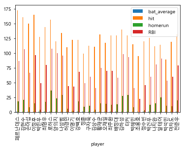

```python
from urllib.request import urlopen
from bs4 import BeautifulSoup
from urllib.request import urlopen
from urllib.error   import HTTPError
from urllib.error   import URLError
```


```python
try:
    html = urlopen('https://www.koreabaseball.com/Record/Player/HitterBasic/Basic1.aspx')
except HTTPError as he :
    print('http error')
except URLError as ue :
    print('url error')
else :
    soup = BeautifulSoup(html.read() , 'html.parser')
```


```python
table = soup.find('table', { 'class': 'tData01 tt' }) 
```


```python
#데이터를 저장할 리스트 생성
data = []   
```


```python
for tr in table.find_all('tr'):
    tds = list(tr.find_all('td'))   
    
    for td in tds:
        
        if td.find('a'):    
            
            #<a> 태그 안에서 선수 이름을 가져옴
            player = td.find('a').text
            #<td> 태그 리스트의 '네 번째'(인덱스 3)에서 타율을 가지고 온다.
            bat_average = tds[3].text        
            #<td> 태그 리스트의 '아홉번째'(인덱스 8)에서 안타를 가져온다.
            hit = tds[8].text
            #<td> 태그 리스트의 '열두번째'(인덱스 11)에서 홈런을 가져온다.
            homerun = tds[11].text
            #<td> 태그 리스트의 '열네번째'(인덱스 13)에서 타점을 가져온다.
            RBI = tds[13].text               
             #dat 리스트에 선수, 타율, 안타를 추가
            data.append([player, bat_average, hit, homerun, RBI])  

```


```python
data
```


    [['페르난데스', '0.355', '173', '18', '87'],
     ['김현수', '0.352', '161', '21', '107'],
     ['손아섭', '0.350', '150', '8', '67'],
     ['이정후', '0.347', '165', '15', '97'],
     ['박민우', '0.345', '128', '4', '49'],
     ['최형우', '0.344', '144', '17', '80'],
     ['로하스', '0.344', '157', '37', '108'],
     ['양의지', '0.328', '120', '23', '100'],
     ['나성범', '0.327', '134', '29', '96'],
     ['허경민', '0.324', '110', '6', '44'],
     ['이명기', '0.318', '123', '2', '43'],
     ['강백호', '0.315', '123', '18', '68'],
     ['정훈', '0.312', '99', '9', '49'],
     ['구자욱', '0.312', '113', '11', '60'],
     ['김상수', '0.312', '111', '4', '41'],
     ['황재균', '0.311', '132', '15', '75'],
     ['오재일', '0.307', '118', '14', '70'],
     ['최주환', '0.306', '130', '12', '70'],
     ['배정대', '0.302', '130', '13', '58'],
     ['김하성', '0.302', '140', '27', '98'],
     ['터커', '0.301', '130', '29', '93'],
     ['박해민', '0.299', '115', '8', '41'],
     ['조용호', '0.297', '95', '0', '22'],
     ['정수빈', '0.295', '120', '3', '46'],
     ['박건우', '0.294', '126', '12', '60'],
     ['나지완', '0.291', '112', '15', '81'],
     ['알테어', '0.291', '114', '25', '91'],
     ['박석민', '0.290', '89', '11', '53'],
     ['마차도', '0.290', '119', '10', '60'],
     ['전준우', '0.289', '133', '20', '79']]


```python
with open('2020KBObatter.csv', 'w', encoding="utf-8") as file:       
    # 컬럼 이름 추가
    file.write('player, bat_average, hit, homerun, RBI\n')            
    
    # data를 반복하면서  선수이름,타율,안타수를 줄 단위로 저장
    for idx in data:                                   
        file.write('{},{},{},{},{}\n'.format(idx[0], idx[1], idx[2], idx[3], idx[4]))
```


```python
%matplotlib inline
import pandas as pd          
import matplotlib as mpl     
import matplotlib.pyplot as plt
```


```python
df = pd.read_csv('./2020KBObatter.csv', index_col='player', encoding='utf-8')
df            

```


<div>
<style scoped>
    .dataframe tbody tr th:only-of-type {
        vertical-align: middle;
    }

    .dataframe tbody tr th {
        vertical-align: top;
    }

    .dataframe thead th {
        text-align: right;
    }
</style>
<table border="1" class="dataframe">
  <thead>
    <tr style="text-align: right;">
      <th></th>
      <th>bat_average</th>
      <th>hit</th>
      <th>homerun</th>
      <th>RBI</th>
    </tr>
    <tr>
      <th>player</th>
      <th></th>
      <th></th>
      <th></th>
      <th></th>
    </tr>
  </thead>
  <tbody>
    <tr>
      <th>페르난데스</th>
      <td>0.355</td>
      <td>173</td>
      <td>18</td>
      <td>87</td>
    </tr>
    <tr>
      <th>김현수</th>
      <td>0.352</td>
      <td>161</td>
      <td>21</td>
      <td>107</td>
    </tr>
    <tr>
      <th>손아섭</th>
      <td>0.350</td>
      <td>150</td>
      <td>8</td>
      <td>67</td>
    </tr>
    <tr>
      <th>이정후</th>
      <td>0.347</td>
      <td>165</td>
      <td>15</td>
      <td>97</td>
    </tr>
    <tr>
      <th>박민우</th>
      <td>0.345</td>
      <td>128</td>
      <td>4</td>
      <td>49</td>
    </tr>
    <tr>
      <th>최형우</th>
      <td>0.344</td>
      <td>144</td>
      <td>17</td>
      <td>80</td>
    </tr>
    <tr>
      <th>로하스</th>
      <td>0.344</td>
      <td>157</td>
      <td>37</td>
      <td>108</td>
    </tr>
    <tr>
      <th>양의지</th>
      <td>0.328</td>
      <td>120</td>
      <td>23</td>
      <td>100</td>
    </tr>
    <tr>
      <th>나성범</th>
      <td>0.327</td>
      <td>134</td>
      <td>29</td>
      <td>96</td>
    </tr>
    <tr>
      <th>허경민</th>
      <td>0.324</td>
      <td>110</td>
      <td>6</td>
      <td>44</td>
    </tr>
    <tr>
      <th>이명기</th>
      <td>0.318</td>
      <td>123</td>
      <td>2</td>
      <td>43</td>
    </tr>
    <tr>
      <th>강백호</th>
      <td>0.315</td>
      <td>123</td>
      <td>18</td>
      <td>68</td>
    </tr>
    <tr>
      <th>정훈</th>
      <td>0.312</td>
      <td>99</td>
      <td>9</td>
      <td>49</td>
    </tr>
    <tr>
      <th>구자욱</th>
      <td>0.312</td>
      <td>113</td>
      <td>11</td>
      <td>60</td>
    </tr>
    <tr>
      <th>김상수</th>
      <td>0.312</td>
      <td>111</td>
      <td>4</td>
      <td>41</td>
    </tr>
    <tr>
      <th>황재균</th>
      <td>0.311</td>
      <td>132</td>
      <td>15</td>
      <td>75</td>
    </tr>
    <tr>
      <th>오재일</th>
      <td>0.307</td>
      <td>118</td>
      <td>14</td>
      <td>70</td>
    </tr>
    <tr>
      <th>최주환</th>
      <td>0.306</td>
      <td>130</td>
      <td>12</td>
      <td>70</td>
    </tr>
    <tr>
      <th>배정대</th>
      <td>0.302</td>
      <td>130</td>
      <td>13</td>
      <td>58</td>
    </tr>
    <tr>
      <th>김하성</th>
      <td>0.302</td>
      <td>140</td>
      <td>27</td>
      <td>98</td>
    </tr>
    <tr>
      <th>터커</th>
      <td>0.301</td>
      <td>130</td>
      <td>29</td>
      <td>93</td>
    </tr>
    <tr>
      <th>박해민</th>
      <td>0.299</td>
      <td>115</td>
      <td>8</td>
      <td>41</td>
    </tr>
    <tr>
      <th>조용호</th>
      <td>0.297</td>
      <td>95</td>
      <td>0</td>
      <td>22</td>
    </tr>
    <tr>
      <th>정수빈</th>
      <td>0.295</td>
      <td>120</td>
      <td>3</td>
      <td>46</td>
    </tr>
    <tr>
      <th>박건우</th>
      <td>0.294</td>
      <td>126</td>
      <td>12</td>
      <td>60</td>
    </tr>
    <tr>
      <th>나지완</th>
      <td>0.291</td>
      <td>112</td>
      <td>15</td>
      <td>81</td>
    </tr>
    <tr>
      <th>알테어</th>
      <td>0.291</td>
      <td>114</td>
      <td>25</td>
      <td>91</td>
    </tr>
    <tr>
      <th>박석민</th>
      <td>0.290</td>
      <td>89</td>
      <td>11</td>
      <td>53</td>
    </tr>
    <tr>
      <th>마차도</th>
      <td>0.290</td>
      <td>119</td>
      <td>10</td>
      <td>60</td>
    </tr>
    <tr>
      <th>전준우</th>
      <td>0.289</td>
      <td>133</td>
      <td>20</td>
      <td>79</td>
    </tr>
  </tbody>
</table>
</div>


```python
# 한글 폰트 문제 해결
import platform

from matplotlib import font_manager, rc
# plt.rcParams['axes.unicode_minus'] = False

if platform.system() == 'Darwin':
    rc('font', family='AppleGothic')
elif platform.system() == 'Windows':
    path = "c:/Windows/Fonts/malgun.ttf"
    font_name = font_manager.FontProperties(fname=path).get_name()
    rc('font', family=font_name)
else:
    print('Unknown system... sorry~~~~') 

```


```python
df.plot.bar()
```


    <matplotlib.axes._subplots.AxesSubplot at 0x1fb28416f60>




